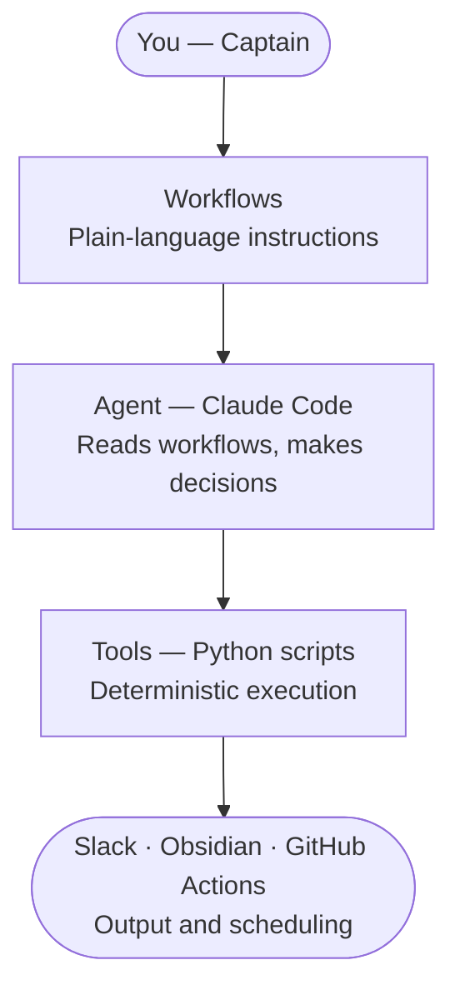
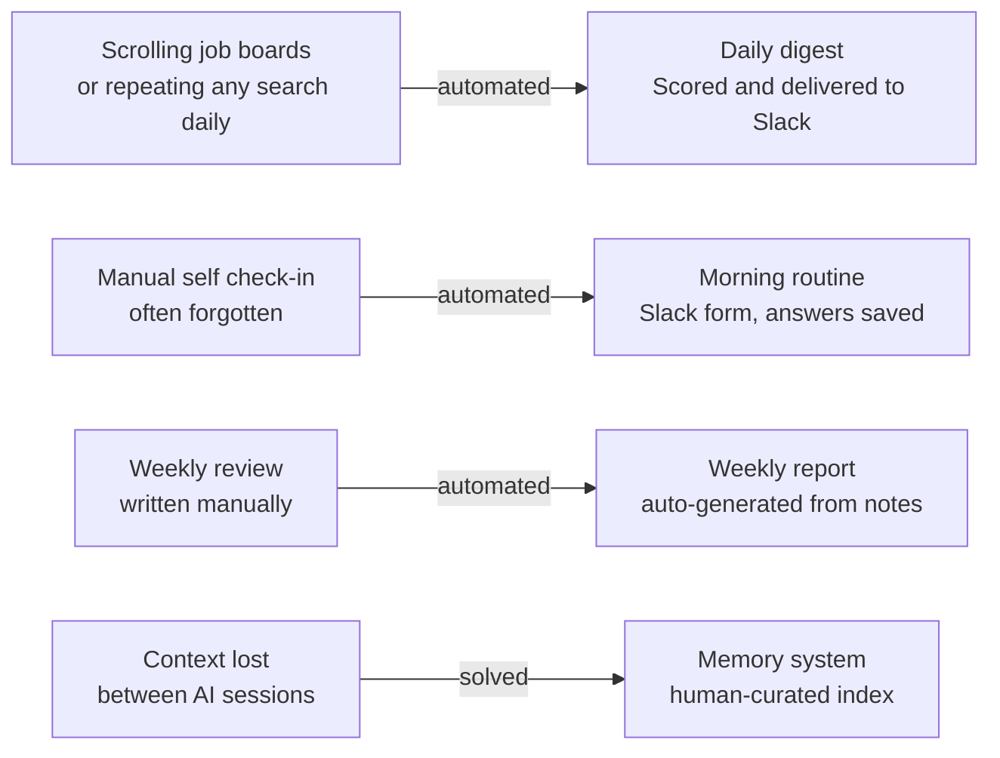

# LateOS — Personal AI Operating System

A personal productivity system built with Claude Code. No manual coding required — workflows, logic, and orchestration only.

Built to automate repetitive daily tasks, surface relevant information, and track patterns over time.

## How it works

## Why it exists

## This is a template, not a plugin

LateOS is not installed with one command. It is a personal system you build and adapt to your own use case.

What you get: the architecture, the scripts, the workflows, and the configuration structure. What you bring: your own API keys, your own preferences, your own questions.

Fork it, adapt it, make it yours.

## What it does

- **Daily digest** — scrapes multiple sources, scores results by keyword match and LLM analysis, sends a Slack notification with only the ones worth opening. Includes interactive feedback buttons so the system learns your preferences over time.
- **Morning routine** — daily Slack check-in tracking energy levels, priorities, and completed tasks. Goal: build enough data to spot patterns over time — what conditions produce good work, what keeps getting postponed and why.
- **Weekly wellbeing report** — auto-generated every week. Correlates energy, sleep, stress, and exercise. Flags recurring blockers and patterns using LLM analysis.
- **Weekly news digest** — curated summary of relevant developments in a topic of your choice, delivered to Slack.
- **Call transcription** — transcribes and summarizes audio recordings, posts results to Slack.
- **Content capture** — reads messages from a connected channel and stores them for later processing.

## Architecture

Built on the WAT framework (Workflows, Agents, Tools):

- **Workflows** — plain-language instructions defining what to do and how. The agent reads these before acting.
- **Agent** — Claude Code reads the workflows and orchestrates execution. Handles decisions, edge cases, and sequencing.
- **Tools** — Python scripts that do the actual work: scraping, scoring, API calls, file operations.

The principle: AI handles orchestration and judgment. Deterministic scripts handle execution. This keeps accuracy high across multi-step pipelines.

## Tech stack

Python · Claude Code · LLM API of your choice (Groq, OpenAI, Anthropic — free tier sufficient for daily use) · Slack API · GitHub Actions (scheduling) · SQLite · Obsidian

## Getting started

1. Clone this repo
2. Copy `.env.example` to `.env` and fill in your keys
3. Install dependencies: `pip install -r requirements.txt`
4. Copy `Profile/preferences.example.yml` to `Profile/preferences.yml` and adapt to your use case
5. Copy `Profile/morning_routine.example.md` to `Profile/morning_routine.md` and write your own questions
6. Run any tool directly: `python Tools/run_daily_digest.py`

For automated scheduling, see `workflows/github_actions_setup.md`.

## Personalization

The system is designed to be adapted, not used out of the box. Two files define how it behaves for you:

- `Profile/preferences.yml` — keywords, scoring thresholds, filters. See `preferences.example.yml` for structure.
- `Profile/morning_routine.md` — your daily check-in questions. See `morning_routine.example.md` for inspiration.

These files are yours. The examples show the structure, the content is up to you.

## Design philosophy

The memory architecture ended up resembling what MemPalace later formalized — selective retrieval instead of loading everything, human-curated instead of automated. We got there independently.

General principle throughout: human as captain, AI as navigator. The human decides what is worth keeping, what is worth automating, and where judgment is still needed. The AI handles execution.

## What this is not

This is a personal system, not a polished product. The code is functional and tested but built for one person's workflow. Fork it, adapt it, break it — that is the point.

## Why this exists

To understand where AI genuinely helps versus where human judgment is still needed. Turns out the answer is interesting.
