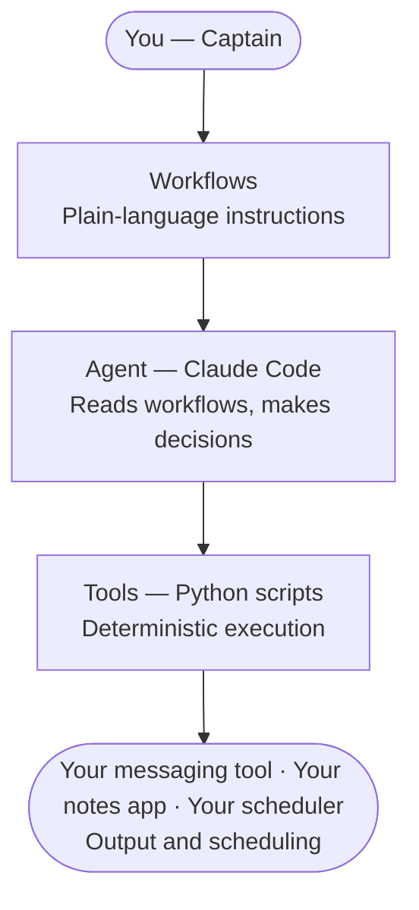
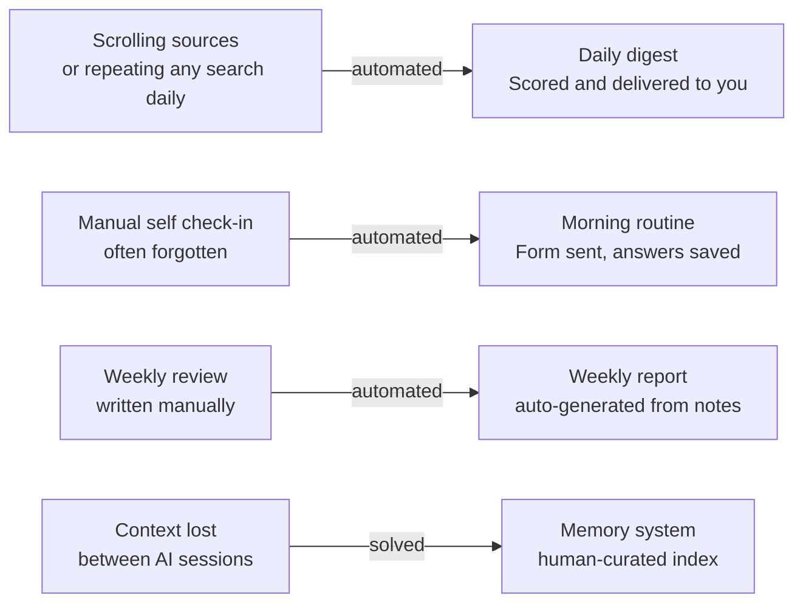

```
██╗      █████╗ ████████╗███████╗ ██████╗ ███████╗
██║     ██╔══██╗╚══██╔══╝██╔════╝██╔═══██╗██╔════╝
██║     ███████║   ██║   █████╗  ██║   ██║███████╗
██║     ██╔══██║   ██║   ██╔══╝  ██║   ██║╚════██║
███████╗██║  ██║   ██║   ███████╗╚██████╔╝███████║
╚══════╝╚═╝  ╚═╝   ╚═╝   ╚══════╝ ╚═════╝ ╚══════╝
```

# LateOS — Personal AI Operating System

   

A personal productivity system built with Claude Code. No manual coding required — workflows, logic, and orchestration only.

Built to automate repetitive daily tasks, surface relevant information, and track patterns over time.

## How it works



## Why it exists



## This is a blueprint, not a product

This is not released as an installable package, and that is intentional. The point of this system is that **you are the captain**. What sources matter to you, what questions you ask yourself each morning, what counts as a good result: those are yours to decide. **AI is the tool that executes.** You decide what it does.

What you get here is a tested architecture so you do not have to figure out the plumbing from scratch. The structure works. The interfaces are defined. The workflows describe the intent. You bring your own sources, your own API keys, and your own questions.

Fork it, read the workflows, and build the version that fits you.

## What it does

- **Daily digest** — scrapes multiple sources, scores results by keyword match and LLM analysis, delivers only the ones worth opening. Includes interactive feedback buttons so the system learns your preferences over time.
- **Morning routine** — daily check-in tracking energy levels, priorities, and completed tasks. Goal: build enough data to spot patterns over time. What conditions produce good work, what keeps getting postponed and why.
- **Weekly wellbeing report** — auto-generated every week. Correlates energy, sleep, stress, and exercise. Flags recurring blockers and patterns using LLM analysis.
- **Weekly news digest** — curated summary of relevant developments in a topic of your choice, delivered to your messaging tool.
- **Call transcription** — transcribes and summarizes audio recordings, saves as a structured note.
- **Content capture** — reads messages from a connected channel and stores them for later processing.

## Architecture

Built on the WAT framework (Workflows, Agents, Tools):

- **Workflows** — plain-language instructions defining what to do and how. The agent reads these before acting.
- **Agent** — Claude Code reads the workflows and orchestrates execution. Handles decisions, edge cases, and sequencing.
- **Tools** — Python scripts that do the actual work: scraping, scoring, API calls, file operations.

The principle: AI handles orchestration and judgment. Deterministic scripts handle execution. This keeps accuracy high across multi-step pipelines.

## Tech stack

Python · Claude Code · LLM API of your choice (Groq, OpenAI, Anthropic, free tier sufficient for daily use) · messaging tool API · scheduler (GitHub Actions or any cron) · SQLite · notes app of your choice

## Getting started

1. Clone this repo
2. Read the workflows in `workflows/` — start with `daily_digest.md`
3. Copy `.env.example` to `.env` and fill in your keys
4. Copy `Profile/preferences.example.yml` to `Profile/preferences.yml` and adapt to your use case
5. Copy `Profile/morning_routine.example.md` to `Profile/morning_routine.md` and write your own questions
6. Open `Tools/source_example.py` and add your first source
7. Implement the missing pieces in each script — each file has comments explaining what to build
8. Run a dry run to test: `python Tools/run_daily_digest.py --dry`

For automated scheduling, see `workflows/github_actions_setup.md`.

## Personalization

The system is designed to be adapted, not used out of the box. Two files define how it behaves for you:

- `Profile/preferences.yml` — keywords, scoring thresholds, filters. See `preferences.example.yml` for structure.
- `Profile/morning_routine.md` — your daily check-in questions. See `morning_routine.example.md` for inspiration.

These files are yours. The examples show the structure, the content is up to you.

## Design philosophy

The memory architecture uses selective retrieval instead of loading everything into context — human-curated rather than automated. Similar to what dedicated memory systems (e.g. MemPalace) formalize, but deliberately simpler.

General principle throughout: human as captain, AI as the tool that executes. The human decides what is worth keeping, what is worth automating, and where judgment is still needed.

## What this is not

This is a personal system, not a polished product. The code is functional and tested but built for one person's workflow. Fork it, adapt it, break it — that is the point.

## Why this exists

To understand where AI genuinely helps versus where human judgment is still needed. Turns out the answer is interesting.
